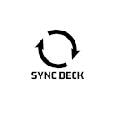

# Sync Deck

This is a Godot 4.x plugin that enables the Godot Editor to send build games to the Steam deck. Tested on MacOS and Linux, as the **scp** application is needed.

## Setup
1) Setup Password.
2) Enable ssh on the steam deck.
3) Create ssh keys on the dev machine
4) Copy the created keys to the steam deck with **ssh-copy-id**
5) ssh into the steam deck to add the steam deck identify to you dev machine

In the Godot Editor create a Linux build(embed pck), then enter the IP of the Steam deck, the user of the Steam deck, the path of the Game build, and the locations on the Steam deck where the build should be copied to. 

After the first sync to the deck, the game can be added as a non-steam game and then after every sync the game can be tested from game mode. The steam deck shouldn't be sleeping for this to work.

### Change logs
1.6
----
- Send file in a seperate process, not blocking the main Godot process.
- Added sound feedback.
